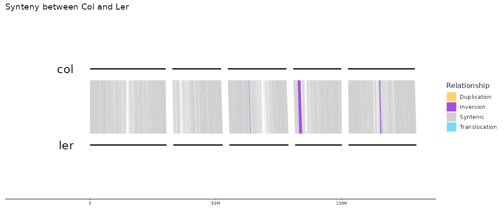
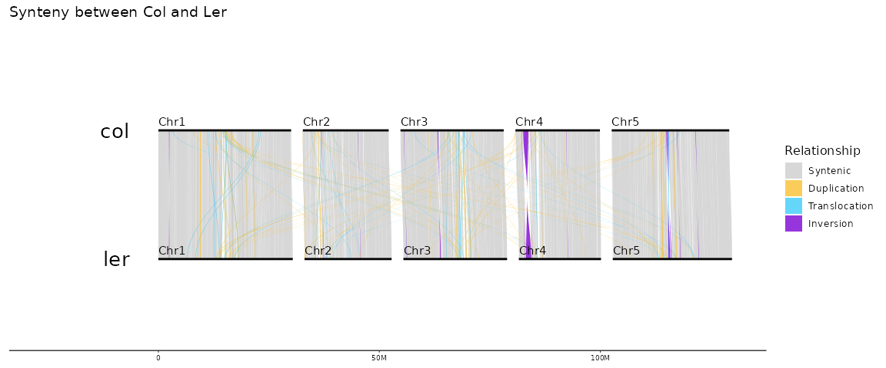
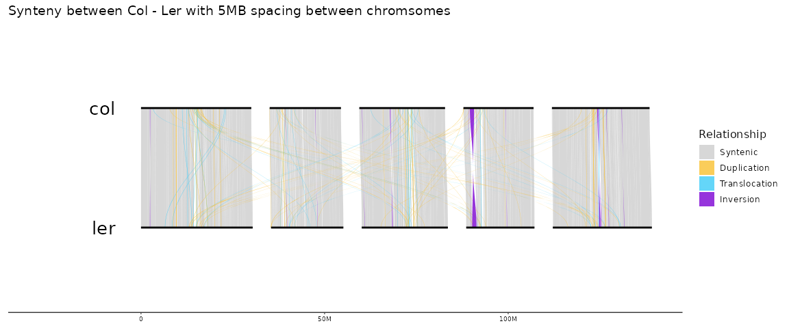
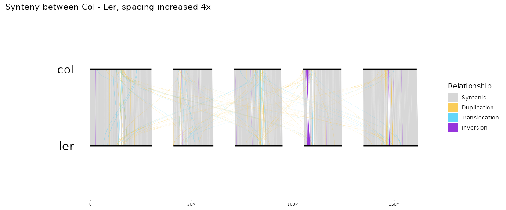
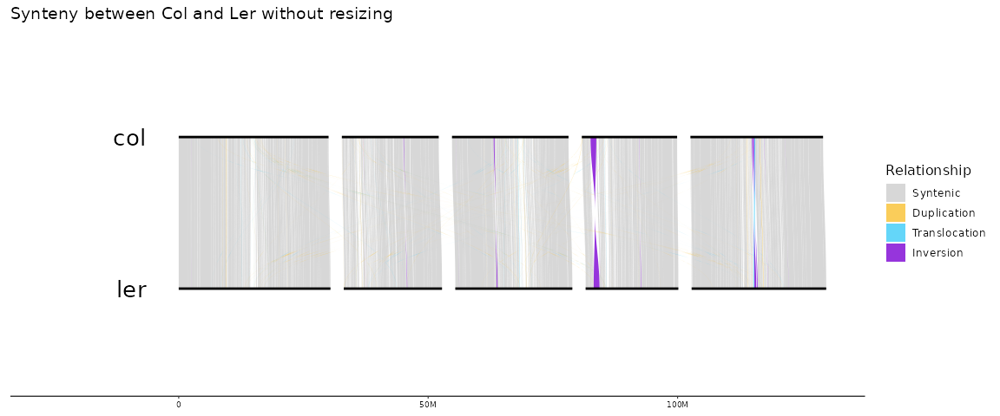
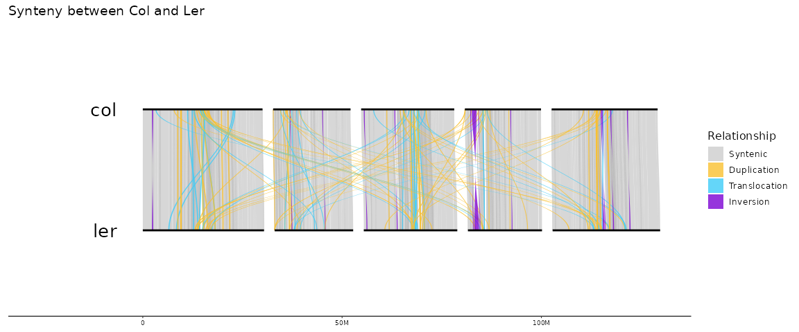
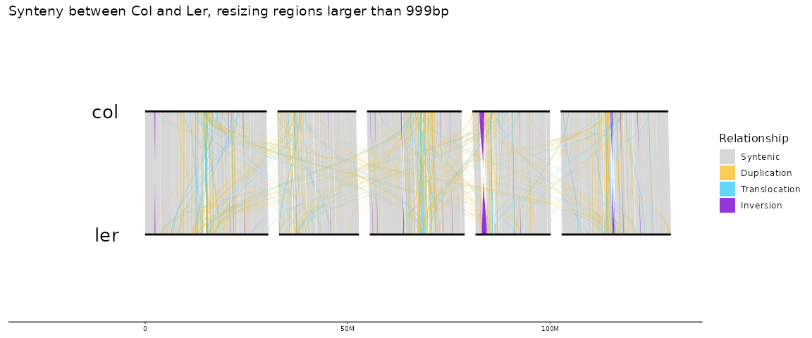

Parse SyRi into R and plot with gggenomes
================
Niklas Schandry

# About

Here I provide a set of function to read in SyRi-output, and plot it.
Overall, the results can look similar to what
[`plotsr`](https://github.com/schneebergerlab/plotsr/) creates. The
files included here in `data/` for demonstration are the
[`plotsr`](https://github.com/schneebergerlab/plotsr/) example files.

Running this requires ‘tidyverse’ (`dplyr`, `dtplyr`, `magrittr`, and
`vroom`) and the output is designed to be compatible with
[`gggenomes`](https://github.com/thackl/gggenomes) for plotting. This
repo also comes with a snapshot that can be used with `renv::restore()`.
The calculation of polygons to draw curves between sequences is directly
lifted from the amazing
[`GENESPACE`](https://github.com/jtlovell/GENESPACE) package, but
`GENESPACE` is not a dependency.

``` r
renv::install("tidyverse","thackl/gggenomes")
```

``` r
library(tidyverse)
library(gggenomes)
library(magrittr)
source("functions/parse_syri.R")
```

# Input

The functions here are intended to work with the outputs from
[`nf-plotsv`](https://github.com/nschan/nf-plotsv). Therefore, the
script expects the syri output to be named
`genomeA_on_genomeB.syri.out`, and will split based on this. There is
*no* flexibility here.

# Running

In this example, genomeA is col and genomeB is ler.

``` r
dat <- parse_syri("data/col_on_ler.syri.out",
                  order = data.frame(bin_id = c("col","ler"))
                  )
```

# Plotting

``` r
gggenomes::gggenomes(seqs = dat$seqs,
                     links = dat$links) + 
  geom_polygon(
    data = dat$polys %>% filter(direct) %>% filter(type == "SYN"),
    aes(
      x = x,
      y = y,
      fill = type,
      group = link_grp
    ),
    alpha = 0.6
  ) +
  geom_polygon(
    data = dat$polys %>% filter(direct) %>% filter(type != "SYN"),
    aes(
      x = x,
      y = y,
      fill = type,
      group = link_grp
    ),
    alpha = 0.8
  ) +
  geom_seq(linewidth = 1) + 
  geom_bin_label(size=7) +
  #geom_link() +
  syri_plot_fills  +
  ggtitle("Synteny between Col and Ler")
```

<!-- -->

# Options

## Selecting chromosomes

Sometimes, only a subset of chromosomes is relevant. `parse_syri()`
expects chromosome names to be identical across genomes. If that is the
case, chromosomes can be selected with the `chroms` parameter

``` r
dat <- parse_syri("data/col_on_ler.syri.out",
                  order = data.frame(bin_id = c("col","ler")),
                  chroms = c("Chr1","Chr3")
                  )
```

``` r
gggenomes::gggenomes(seqs = dat$seqs,
                     links = dat$links) + 
  geom_polygon(
    data = dat$polys %>% filter(direct) %>% filter(type == "SYN"),
    aes(
      x = x,
      y = y,
      fill = type,
      group = link_grp
    ),
    alpha = 0.6
  ) +
  geom_polygon(
    data = dat$polys %>% filter(direct) %>% filter(type != "SYN"),
    aes(
      x = x,
      y = y,
      fill = type,
      group = link_grp
    ),
    alpha = 0.8
  ) +
  geom_seq(linewidth = 1) + 
  geom_bin_label(size=7) +
  #geom_link() +
  syri_plot_fills  +
  ggtitle("Synteny between Col and Ler Chromosomes 1 and 3")
```

<!-- -->

## Spacing

Sometimes, the default spacing between chromosomes may not be optimal.
`parse_syri()` follows gggenomes in spacing rules. If spacing is \< 1,
it is relative to the longest bin / sqrt(number of sequences), if it is
\>= 1 it is base pairs. The default is 0.05 (as for gggenomes)

### In basepairs

``` r
dat <- parse_syri("data/col_on_ler.syri.out",
                  order = data.frame(bin_id = c("col","ler")),
                  spacing = 5000000 # spacing in bp
                  )
```

Of course, if the spacing was changed, this also needs to be adjusted in
gggenomes:

``` r
gggenomes::gggenomes(seqs = dat$seqs,
                     links = dat$links,
                     spacing = 5000000) + 
  geom_polygon(
    data = dat$polys %>% filter(direct) %>% filter(type == "SYN"),
    aes(
      x = x,
      y = y,
      fill = type,
      group = link_grp
    ),
    alpha = 0.6
  ) +
  geom_polygon(
    data = dat$polys %>% filter(direct) %>% filter(type != "SYN"),
    aes(
      x = x,
      y = y,
      fill = type,
      group = link_grp
    ),
    alpha = 0.8
  ) +
  geom_seq(linewidth = 1) + 
  geom_bin_label(size=7) +
  syri_plot_fills  +
  ggtitle("Synteny between Col - Ler with 5MB spacing between chromsomes")
```

<!-- -->

### Relative

4 times the standard spacing:

``` r
dat <- parse_syri("data/col_on_ler.syri.out",
                  order = data.frame(bin_id = c("col","ler")),
                  spacing = 0.2 # relative spacing
                  )
```

``` r
gggenomes::gggenomes(seqs = dat$seqs,
                     links = dat$links,
                     spacing = 0.2) + 
  geom_polygon(
    data = dat$polys %>% filter(direct) %>% filter(type == "SYN"),
    aes(
      x = x,
      y = y,
      fill = type,
      group = link_grp
    ),
    alpha = 0.6
  ) +
  geom_polygon(
    data = dat$polys %>% filter(direct) %>% filter(type != "SYN"),
    aes(
      x = x,
      y = y,
      fill = type,
      group = link_grp
    ),
    alpha = 0.8
  ) +
  geom_seq(linewidth = 1) + 
  geom_bin_label(size=7) +
  syri_plot_fills  +
  ggtitle("Synteny between Col - Ler, spacing increased 4x")
```

<!-- -->

## No resizing

By default, short syntenic regions larger than 5000 bp are resized to
make them visible. Since this does not reflect the original input, this
can be disabled:

``` r
dat <- parse_syri("data/col_on_ler.syri.out",
                  order = data.frame(bin_id = c("col","ler")),
                  resize_polygons = F)
```

``` r
gggenomes::gggenomes(seqs = dat$seqs,
                     links = dat$links) + 
  geom_polygon(
    data = dat$polys %>% filter(direct) %>% filter(type == "SYN"),
    aes(
      x = x,
      y = y,
      fill = type,
      group = link_grp
    ),
    alpha = 0.6
  ) +
  geom_polygon(
    data = dat$polys %>% filter(direct) %>% filter(type != "SYN"),
    aes(
      x = x,
      y = y,
      fill = type,
      group = link_grp
    ),
    alpha = 0.8
  ) +
  geom_seq(linewidth = 1) + 
  geom_bin_label(size=7) +
  syri_plot_fills  +
  ggtitle("Synteny between Col and Ler without resizing")
```

<!-- -->

## Minimum resize size

Only regions larger than `min_polygon_feat_size` are resized (default
5000), this can be modified to also include smaller regions

``` r
dat <- parse_syri("data/col_on_ler.syri.out",
                  order = data.frame(bin_id = c("col","ler")),
                  resize_polygons = T,
                  min_polygon_feat_size = 1000)
```

Naturally, this will create a busier plot.

``` r
gggenomes::gggenomes(seqs = dat$seqs,
                     links = dat$links) + 
  geom_polygon(
    data = dat$polys %>% filter(direct) %>% filter(type == "SYN"),
    aes(
      x = x,
      y = y,
      fill = type,
      group = link_grp
    ),
    alpha = 0.6
  ) +
  geom_polygon(
    data = dat$polys %>% filter(direct) %>% filter(type != "SYN"),
    aes(
      x = x,
      y = y,
      fill = type,
      group = link_grp
    ),
    alpha = 0.8
  ) +
  geom_seq(linewidth = 1) + 
  geom_bin_label(size=7) +
  syri_plot_fills  +
  ggtitle("Synteny between Col and Ler, resizing regions larger than 999bp")
```

<!-- -->

## Resize output size

Regions are resized to have a certain length relative to the chromosome,
controlled by `resize_polygons_size`, which defaults to `0.003` (0.3%)
of the chromosome length. Altering this will make resized regions
larger, or smaller.

``` r
dat <- parse_syri("data/col_on_ler.syri.out",
                  order = data.frame(bin_id = c("col","ler")),
                  resize_polygons = T,
                  resize_polygons_size = 0.01)
```

This will produce wider polygons for resized links.

``` r
gggenomes::gggenomes(seqs = dat$seqs,
                     links = dat$links) + 
  geom_polygon(
    data = dat$polys %>% filter(direct) %>% filter(type == "SYN"),
    aes(
      x = x,
      y = y,
      fill = type,
      group = link_grp
    ),
    alpha = 0.6
  ) +
  geom_polygon(
    data = dat$polys %>% filter(direct) %>% filter(type != "SYN"),
    aes(
      x = x,
      y = y,
      fill = type,
      group = link_grp
    ),
    alpha = 0.8
  ) +
  geom_seq(linewidth = 1) + 
  geom_bin_label(size=7) +
  syri_plot_fills  +
  ggtitle("Synteny between Col and Ler")
```

<!-- -->

# Multiple genomes

Comparing two genomes is nice, but more are better.

`parse_syri` can handle multiple outputs in one go:

``` r
file_list <- list.files("data", full.names = T)
syri_order <- data.frame(bin_id = c("col", "ler", "cvi", "eri"))
dat <- parse_syri(file_list, order = syri_order)
```

Making a plot from this works the same way of making a plot of only one
comparison. The order of sequences is set via the `order` argument to
`parse_syri()`

``` r
gggenomes::gggenomes(seqs = dat$seqs,
                     links = dat$links) + 
  geom_polygon(
    data = dat$polys %>% filter(direct) %>% filter(type == "SYN"),
    aes(
      x = x,
      y = y,
      fill = type,
      group = link_grp
    ),
    alpha = 0.6
  ) +
  geom_polygon(
    data = dat$polys %>% filter(direct) %>% filter(type != "SYN"),
    aes(
      x = x,
      y = y,
      fill = type,
      group = link_grp
    ),
    alpha = 0.8
  ) +
  geom_seq(linewidth = 1) + 
  geom_bin_label(size=7) +
  syri_plot_fills  +
  ggtitle("Synteny between Col - Ler - Cvi - Eri")
```

<!-- -->

# Contributing

If you encounter any problems, please open an issue. If you have
suggestions for improvement, please open a pull request.
