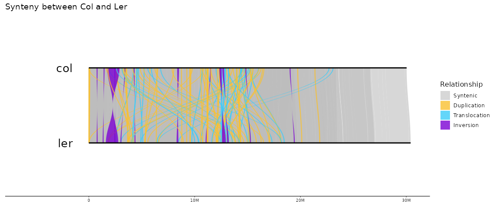

Parse Syri
================
Niklas Schandry

# About

I was looking for a way to plot syri-output, similar to what
[`plotsr`](https://github.com/schneebergerlab/plotsr/) does, but with
easier costumization and in R. I could not find anything, so I wrote
something.

This requires ‘tidyverse’ (only `dplyr` and `vroom`) and
[`gggenomes`](https://github.com/thackl/gggenomes). This repo also comes
with a snapshot that can be used with `renv::restore()`

``` r
renv::install("tidyverse","thackl/gggenomes")
```

``` r
library(tidyverse)
library(gggenomes)
library(magrittr)
source("functions/parse_syri.R")
```

The calculation of polygons for curves between sequences is directly
lifted from [`GENESPACE`](https://github.com/jtlovell/GENESPACE)

# Input

The script expects the syri output to be named
`genomeA_on_genomeB.syri.out`, and will split based on this. There is
*no* flexibility here.

# Running

In this example, genomeA is col and genomeB is ler.

``` r
dat <- parse_syri("data/col_on_ler.syri.out",
                  order = data.frame(bin_id = c("col","ler")))
```

    ## Created seqtab

    ## Created links

    ## Calculating polygons

# Plotting

``` r
gggenomes::gggenomes(seqs = dat$seqs,
                     links = dat$links) + 
  geom_polygon(
    data = dat$polygons %>% filter(direct) %>% filter(type == "SYN"),
    aes(
      x = x,
      y = y,
      fill = type,
      group = link_grp
    ),
    alpha = 0.6
  ) +
  geom_polygon(
    data = dat$polygons %>% filter(direct) %>% filter(type != "SYN"),
    aes(
      x = x,
      y = y,
      fill = type,
      group = link_grp
    ),
    alpha = 0.8
  ) +
  geom_seq(linewidth = 1) + 
  geom_bin_label(size=7) +
  syri_plot_fills  +
  ggtitle("Synteny between Col and Ler")
```

<!-- -->

# Options

## No resizing

By default, short syntenic regions larger than 5000bp are resized to
make them visible. Since this does not reflect the original input, this
can be disabled:

``` r
dat <- parse_syri("data/col_on_ler.syri.out",
                  order = data.frame(bin_id = c("col","ler")),
                  resize_polygons = F)
```

    ## Created seqtab

    ## Created links

    ## Calculating polygons

``` r
gggenomes::gggenomes(seqs = dat$seqs,
                     links = dat$links) + 
  geom_polygon(
    data = dat$polygons %>% filter(direct) %>% filter(type == "SYN"),
    aes(
      x = x,
      y = y,
      fill = type,
      group = link_grp
    ),
    alpha = 0.6
  ) +
  geom_polygon(
    data = dat$polygons %>% filter(direct) %>% filter(type != "SYN"),
    aes(
      x = x,
      y = y,
      fill = type,
      group = link_grp
    ),
    alpha = 0.8
  ) +
  geom_seq(linewidth = 1) + 
  geom_bin_label(size=7) +
  syri_plot_fills  +
  ggtitle("Synteny between Col and Ler without resizing")
```

<!-- -->

## Minimum resize size

Only regions larger than `min_polygon_feat_size` are resized (default
5000), this can be modified to also include smaller regions

``` r
dat <- parse_syri("data/col_on_ler.syri.out",
                  order = data.frame(bin_id = c("col","ler")),
                  resize_polygons = T,
                  min_polygon_feat_size = 1000)
```

    ## Created seqtab

    ## Created links

    ## Calculating polygons

Naturally, this will create a busier plot.

``` r
gggenomes::gggenomes(seqs = dat$seqs,
                     links = dat$links) + 
  geom_polygon(
    data = dat$polygons %>% filter(direct) %>% filter(type == "SYN"),
    aes(
      x = x,
      y = y,
      fill = type,
      group = link_grp
    ),
    alpha = 0.6
  ) +
  geom_polygon(
    data = dat$polygons %>% filter(direct) %>% filter(type != "SYN"),
    aes(
      x = x,
      y = y,
      fill = type,
      group = link_grp
    ),
    alpha = 0.8
  ) +
  geom_seq(linewidth = 1) + 
  geom_bin_label(size=7) +
  syri_plot_fills  +
  ggtitle("Synteny between Col and Ler, resizing regions larger than 999bp")
```

<!-- -->

## Resize output size

Regions are resized to have a certain length relative to the chromosome,
controlled by `resize_polygons_size`, which defaults to `0.003` (0.3%)
of the chromosome length. Altering this will make resized regions
larger, or smaller.

``` r
dat <- parse_syri("data/col_on_ler.syri.out",
                  order = data.frame(bin_id = c("col","ler")),
                  resize_polygons = T,
                  resize_polygons_size = 0.01)
```

    ## Created seqtab

    ## Created links

    ## Calculating polygons

This will produce wider polygons for resized links.

``` r
gggenomes::gggenomes(seqs = dat$seqs,
                     links = dat$links) + 
  geom_polygon(
    data = dat$polygons %>% filter(direct) %>% filter(type == "SYN"),
    aes(
      x = x,
      y = y,
      fill = type,
      group = link_grp
    ),
    alpha = 0.6
  ) +
  geom_polygon(
    data = dat$polygons %>% filter(direct) %>% filter(type != "SYN"),
    aes(
      x = x,
      y = y,
      fill = type,
      group = link_grp
    ),
    alpha = 0.8
  ) +
  geom_seq(linewidth = 1) + 
  geom_bin_label(size=7) +
  syri_plot_fills  +
  ggtitle("Synteny between Col and Ler")
```

<!-- -->
